# Rspamd Quarantine Web UI

Rspamd Quarantine Web UI is a lightweight web application for browsing, managing, and auditing messages processed by an Rspamd‑based mail infrastructure. It is designed for system administrators and helpdesk staff who need fast, safe control over quarantined mail, message traces, and user actions.


---

## Features

### Quarantine Browser
- **Compact table view** with state‑based row coloring (quarantined, spam, ham, released)
- **Quick actions**: release, learn as spam/ham, delete
- **Advanced filtering**: sender, recipient, subject, score range, dates, and state
- **Message preview** with HTML/text toggle in tooltip
- **Symbol popup** showing Rspamd symbols and scores on hover

### Advanced Filtering
- Compact filter bar with visual highlighting of active fields
- Per‑field clear buttons with automatic form submission
- Badge showing number of active filters
- Automatic submit on select changes
- Gradient styling with modern UI/UX

### Message Trace
- Complete history of all processed messages
- Fields: timestamp, sender, recipients, IP address, authenticated user, action, score, symbols
- Useful for debugging deliverability and spam classification issues
- Same filtering capabilities as quarantine view

### Whitelist/Blacklist Map Management (Multimap)
- Dedicated maps view for maintaining Rspamd multimap entries
- Supports whitelist and blacklist lists with tabbed groups per entry type
- Entry types:
  - **Email/domain** (exact match)
  - **Email regex** (regexp entries for mailbox patterns)
  - **Subject regex** (regexp entries for subject filtering)
  - **IP address** (exact match)
- Quick add/remove actions from quarantine and message detail views
- Automatic sync to configured Rspamd servers after every change
- Domain admins can only manage entries they created

### Bulk Operations
- Multi-select actions for quarantine items
- Bulk release, delete, or learn spam/ham in one step
- Confirmation dialogs for destructive actions

### User Management
- Admin UI for creating, editing, and deactivating users
- Role assignment (admin, domain admin, viewer, quarantine user)
- Domain scoping for domain admins
- Optional Postfix mailbox and alias editing in the Users section (requires Postfix DB config and `POSTFIX_ALLOW_MAILBOX_EDIT`)

### Statistics and Charts
- **Volume statistics** for quarantine and trace data
- **Top senders/recipients** with sortable tables (up to 40 records)
- **Action distribution** pie chart (reject, soft reject, add header, no action, pass)
- **State distribution** chart (quarantined, spam, ham, released)
- **Daily and weekly trend charts** with stacked view
- Responsive 2×2 grid layout for charts
- Color scheme aligned with Rspamd semantics

### Inline Summary Header
- Shared header across all views with inline statistic boxes:
  - Total messages
  - Rejected
  - Quarantined
  - HAM/SPAM learned
  - Released
  - Average score

### Audit Log
- Dedicated **Audit Log** view for compliance and security
- Records all user actions:
  - Message releases
  - Spam/HAM training
  - Deletions
  - Map additions/removals
  - Bulk actions
  - User logins
- Shows username, action type, timestamp, IP address, and details
- Colored badges and icons per action type
- Same compact table + filter design as main views

### Role‑Based Access Control
Three access levels:
- **admin** – full access to all data and domains
- **domainadmin** – restricted to configured domains only
- **viewer** – read‑only access as configured
- **quarantine users** – restricted to mailbox or manualy added email address of recipient (IMAP login via email account detected automatically, no need to create user if user has mailbox)

Domain filters are automatically applied in all SQL queries (quarantine, trace, stats, audit).

### Database Schema
Complete MariaDB/MySQL schema with:
- **Core tables**: `quarantine_messages`, `message_trace`
- **Audit tables**: `audit_log`, `trace_log`
- **User management**: `users`, `user_domains`, `sessions`
- **Helper views**:
  - `v_daily_stats` – daily message statistics
  - `v_quarantine_stats_by_domain` – domain-based quarantine metrics
  - `v_spam_ips` – top spam IP addresses
  - `v_top_spammers` – most active spam senders
  - `v_users_with_domains` – user-domain relationships
  - `v_user_activity` – user action summary

### Security Features
- Authentication required on all entry points
- Role-based permission checks per view and action
- Consistent HTML escaping for XSS prevention
- Domain-based SQL filters in prepared statements
- Audit triggers for login tracking
- Password hashing with PHP's `password_hash()`

### Multi-language Support
- Automatic language detection based on the browser `Accept-Language` header
- Manual language override via the language switcher endpoint
- Fallback to Czech when a translation key is missing
- Supported languages: Czech, English, German, Slovak, Polish, Finnish, Danish, Swedish, French, Spanish

---

## Technology Stack

- **Backend**: PHP 8+ (PDO, sessions)
- **Database**: MariaDB/MySQL with full schema and views
- **Mail Engine**: Rspamd (as upstream data source)
- **Frontend**: HTML5/CSS3 with custom compact UI
- **Icons**: Font Awesome 6.4+
- **Charts**: Chart.js 4.4+

---

## Architecture

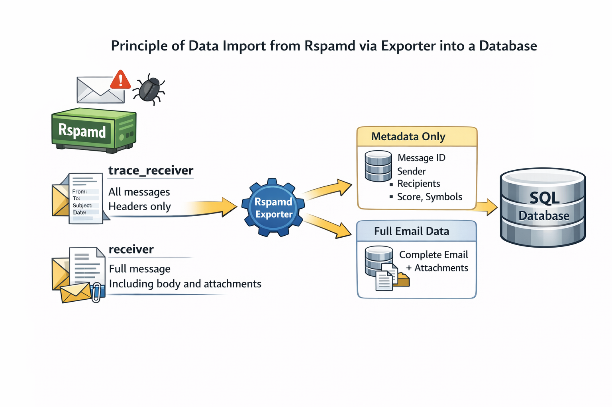

### Components

- **Rspamd**  
  Spam filtering system processing incoming email messages.
- **Rspamd Exporter**  
  Component that exports data from Rspamd to external receivers.
- **SQL Database**  
  Database used to store metadata and quarantined messages.
- **Data Streams**  
  - **trace_receiver**  
    - All messages  
    - Headers only  
    - Lightweight data stream  
    - Used for tracing, statistics, and audit logs  
    - Contains:
      - Message ID
      - Sender
      - Recipients
      - Score
      - Symbols
      - Action
  - **receiver**  
    - Full message  
    - Including body and attachments  
    - Used for quarantine storage and detailed analysis  
    - Contains:
      - Complete raw email (headers + body)
      - Attachments
      - Full metadata

### Data Flow Description

1. Rspamd processes an email.
2. Two parallel data streams are generated:
   - `trace_receiver` → sends header-only metadata for all messages.
   - `receiver` → sends the complete message (including body and attachments) for quarantined or selected messages.
3. Rspamd Exporter forwards both streams.
4. Data are stored in the SQL Database:
   - Metadata in trace/log tables.
   - Full messages in quarantine tables.

---

## Screenshots

### Login
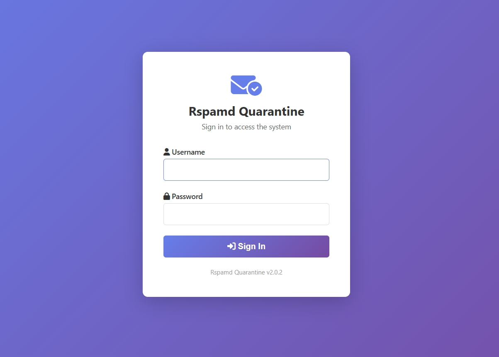

### Quarantine View
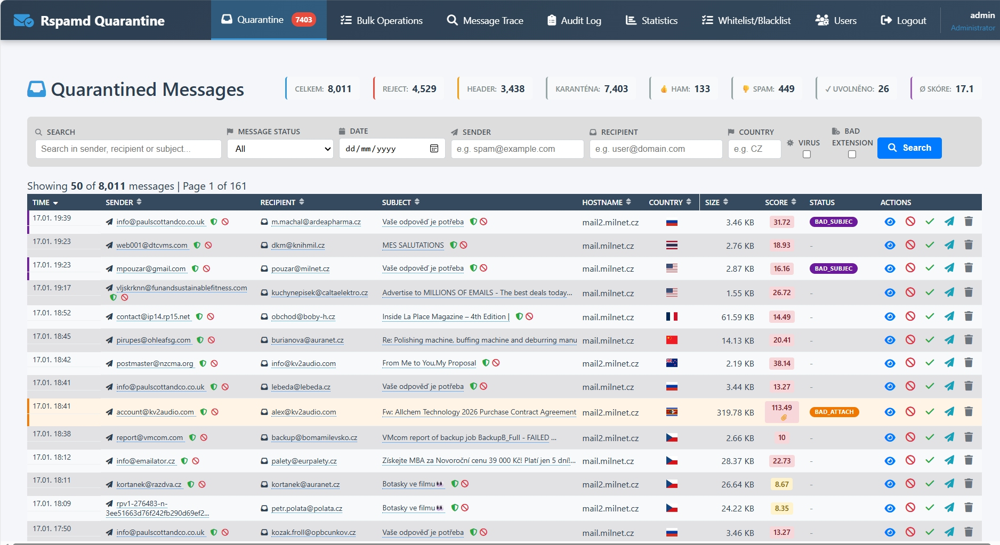

### Message Preview
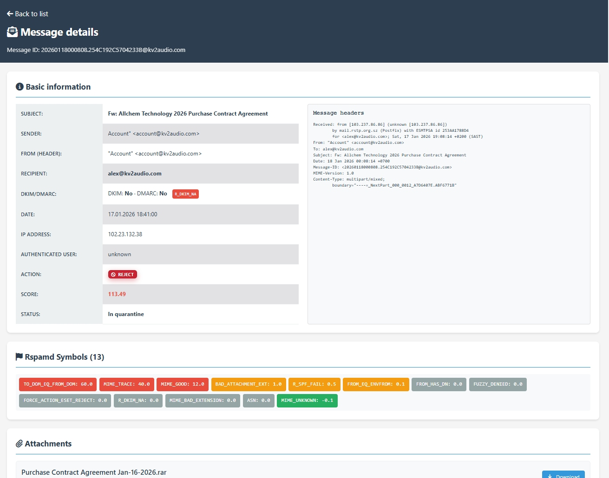

### Quick Preview Tooltip
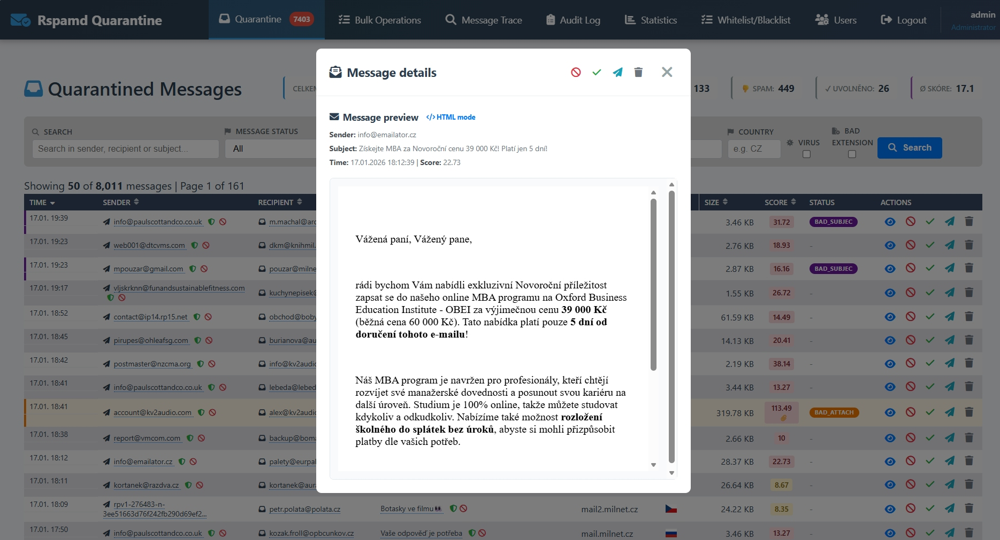

### Whitelist/Blacklist Maps
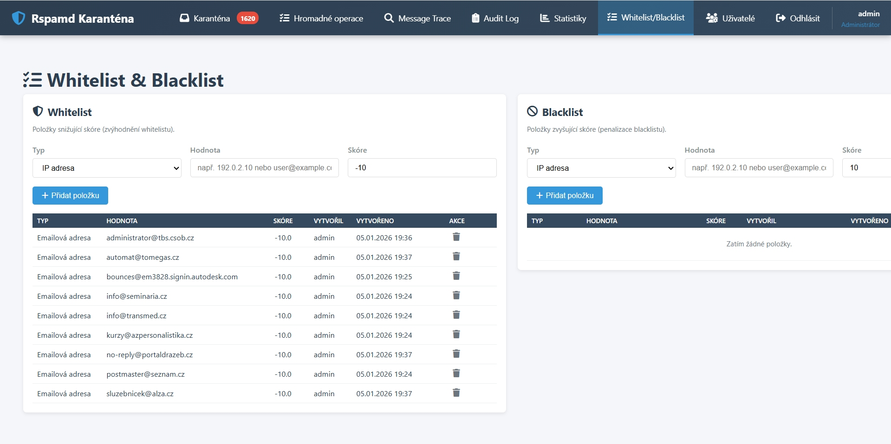

### Add to Whitelist (Subject Regex)
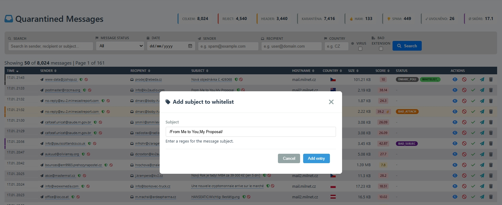

### Add to Blacklist (Sender)


### Bulk Operations
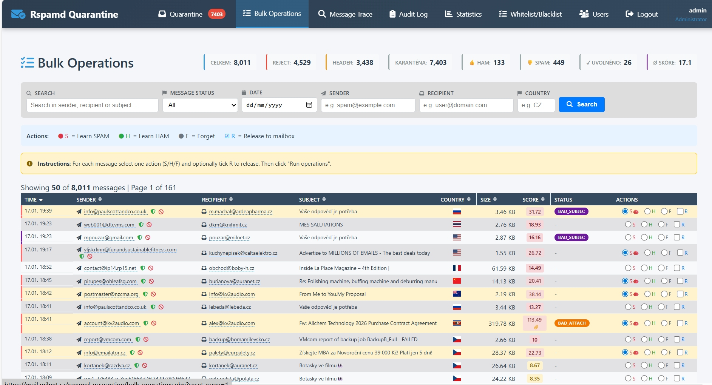

### Message Trace
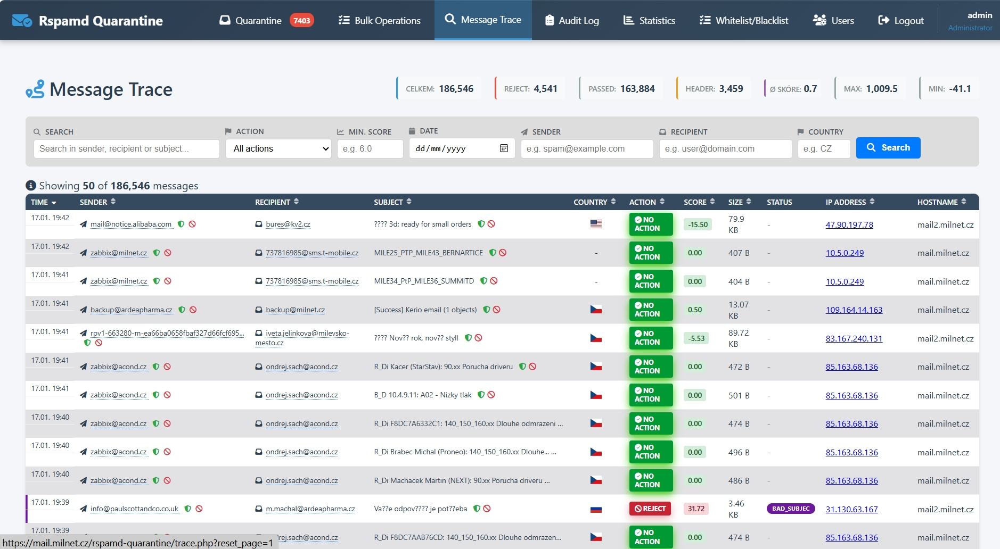

### Symbol Details
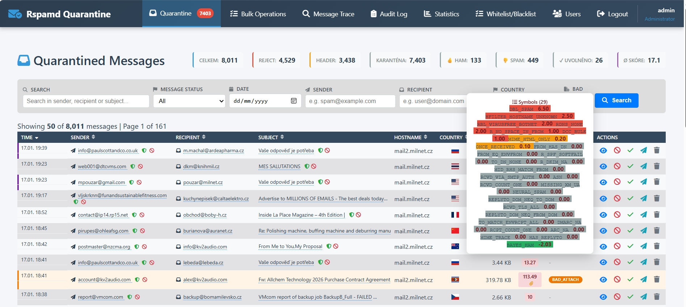

### Statistics Dashboard
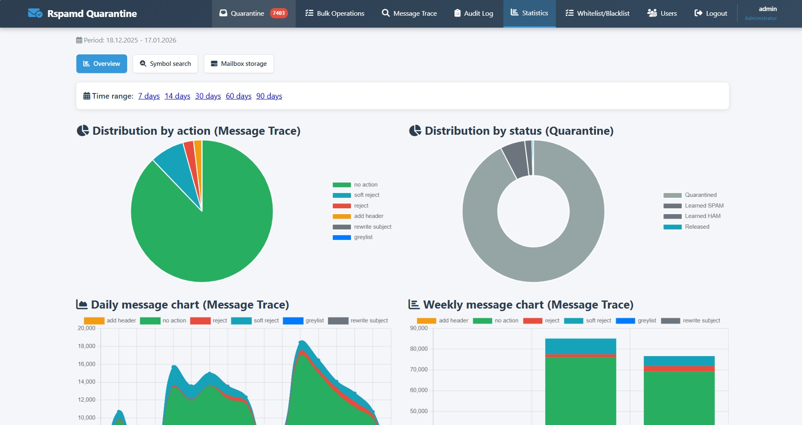

### Audit Log
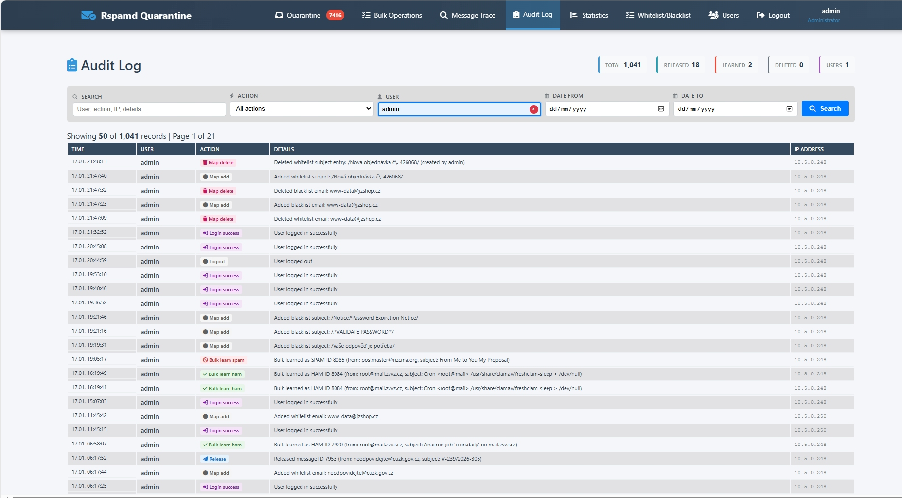

### Service Health
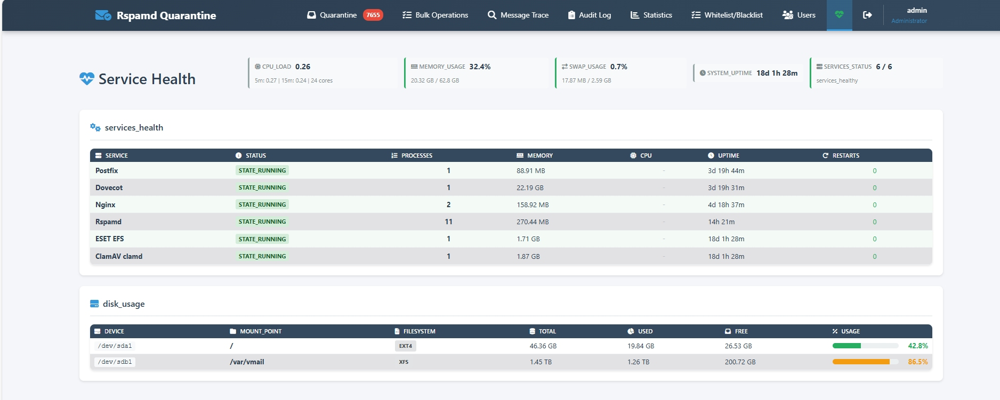

### User Management
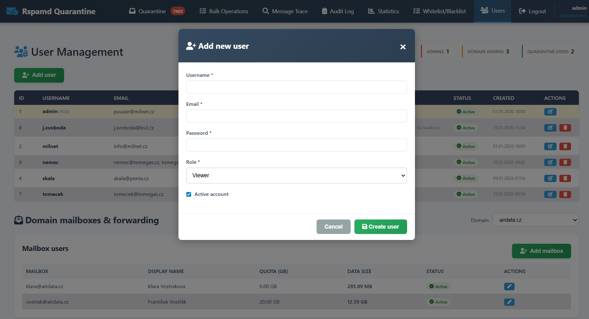

---

## Requirements

- PHP 8.0 or higher
- MariaDB 10.5+ or MySQL 8.0+
- PDO MySQL extension
- Apache/Nginx web server
- Rspamd mail filtering system

---

## Installation

### 1. Clone Repository

```bash
git clone https://github.com/mpouzar-glitch/rspamd-quarantine.git
cd rspamd-quarantine
```

### 2. Create Database

Create a new MariaDB/MySQL database:

```bash
mysql -u root -p
```

```sql
CREATE DATABASE rspamd_quarantine CHARACTER SET utf8mb4 COLLATE utf8mb4_unicode_ci;
CREATE USER 'rspamd_user'@'localhost' IDENTIFIED BY 'your_secure_password';
GRANT ALL PRIVILEGES ON rspamd_quarantine.* TO 'rspamd_user'@'localhost';
FLUSH PRIVILEGES;
EXIT;
```

Import the schema:

```bash
mysql -u root -p rspamd_quarantine < database.sql
```

### 3. Configure Application

Copy the sample config and adjust settings:

```bash
cp config.example.php config.php
```

Edit `config.php`:

```php
<?php
// Database configuration
define('DB_HOST', 'localhost');
define('DB_NAME', 'rspamd_quarantine');
define('DB_USER', 'rspamd_user');
define('DB_PASS', 'your_secure_password');
define('DB_CHARSET', 'utf8mb4');

// Application settings
define('ITEMS_PER_PAGE', 50);
define('SESSION_TIMEOUT', 3600); // 1 hour

// Auto-learn settings (optional)
define('AUTOLEARN_ENABLED', true);
define('AUTOLEARN_SCORE', 15.0);

// Postfix mailbox/alias management (optional)
define('POSTFIX_DB_HOST', 'localhost');
define('POSTFIX_DB_NAME', 'postfix');
define('POSTFIX_DB_USER', 'postfix');
define('POSTFIX_DB_PASS', 'password');
define('POSTFIX_ALLOW_MAILBOX_EDIT', true);
?>
```

#### Optional: MaxMind GeoIP support

Country detection from IP addresses uses the MaxMind GeoLite2 City database and the GeoIP2 PHP reader. To enable it:

1. Install the GeoIP2 PHP library (via Composer):

```bash
composer require geoip2/geoip2
```

2. Download the **GeoLite2 Country** database from MaxMind (requires a free MaxMind account) and place it at:

```
 wget "https://download.maxmind.com/app/geoip_download?edition_id=GeoLite2-Country&license_key=YOUR_LICENCE=tar.gz" -O GeoLite2-Country.tar.gz
```

3. Ensure the web server user can read the database file (for example `www-data`).

If the library or database is missing, country detection will stay blank.

### 4. Web Server Setup

**Apache** - Create a virtual host:

```apache
<VirtualHost *:443>
    ServerName quarantine.example.com
    DocumentRoot /var/www/rspamd-quarantine-webui

    <Directory /var/www/rspamd-quarantine-webui>
        Options -Indexes +FollowSymLinks
        AllowOverride All
        Require all granted
    </Directory>

    SSLEngine on
    SSLCertificateFile /path/to/cert.pem
    SSLCertificateKeyFile /path/to/key.pem
</VirtualHost>
```

**Nginx** - Configuration example:

```nginx
server {
    listen 443 ssl http2;
    server_name quarantine.example.com;
    root /var/www/rspamd-quarantine-webui;
    index index.php;

    ssl_certificate /path/to/cert.pem;
    ssl_certificate_key /path/to/key.pem;

    location / {
        try_files $uri $uri/ /index.php?$query_string;
    }

    location ~ \.php$ {
        fastcgi_pass unix:/var/run/php/php8.2-fpm.sock;
        fastcgi_index index.php;
        fastcgi_param SCRIPT_FILENAME $document_root$fastcgi_script_name;
        include fastcgi_params;
    }
}
```

### 5. Create Admin User

Generate a password hash:

```php
<?php
echo password_hash('your_password', PASSWORD_DEFAULT);
?>
```

Insert admin user into database:

```sql
INSERT INTO users (username, password_hash, email, role, active) 
VALUES ('admin', '$2y$10$...', 'admin@example.com', 'admin', 1);
```

For domain admins, also insert domains:

```sql
INSERT INTO user_domains (user_id, domain) 
VALUES (1, 'example.com'), (1, 'example.org');
```

### 6. File Permissions

```bash
chown -R www-data:www-data /var/www/rspamd-quarantine-webui
chmod 755 /var/www/rspamd-quarantine-webui
chmod 600 config.php
```

---

## Rspamd and Postfix Configuration

Below is a configuration overview for the Rspamd exporter, multimaps, antivirus, and MIME detector. Prepared configurations live in `service_configuration/rspamd` and should be used as the starting point.

### Rspamd Exporter

The exporter forwards data to `receiver.php` and `trace_receiver.php`. Use the prepared configuration from `service_configuration/rspamd` and tailor it to your environment (URLs, timeouts, headers, filters).

### Multimap + map files and permissions for the _rspamd user

Multimap definitions are in `service_configuration/rspamd/multimap.conf`, with map files in `service_configuration/rspamd/maps/`.

1. Copy the map files to your Rspamd data directory (for example `/var/lib/rspamd`).
2. Set permissions for the `_rspamd` user:

```bash
sudo install -d -m 750 -o _rspamd -g _rspamd /var/lib/rspamd
sudo install -m 640 -o _rspamd -g _rspamd service_configuration/rspamd/maps/*.map /var/lib/rspamd/
```

3. Add the multimap configuration to Rspamd (for example in `local.d/multimap.conf`).

### Antivirus and MIME detector

Example antivirus (ClamAV) and MIME detector configuration is in `service_configuration/rspamd`. Copy these files into `local.d/` and adjust them to match your infrastructure (socket/port, exclusions, type lists).

### Postfix milter settings

To connect Rspamd via milter to Postfix, add the following to `main.cf`:

```conf
smtpd_milters = inet:127.0.0.1:11332
non_smtpd_milters = $smtpd_milters
milter_default_action = accept
milter_protocol = 6
```

After changing the configuration, reload both Postfix and Rspamd.

---

## Usage

### Accessing the Interface

1. Open your browser and navigate to:
   ```
   https://quarantine.example.com/
   ```

2. Log in with admin credentials

3. Use the top navigation menu:
   - **Quarantine** – Quarantined messages browser
   - **Bulk operation** – Quarantined messages bulk operation
   - **Message Trace** – Complete message history
   - **Statistics** – Statistics and charts
   - **Audit Log** – User action history (admin/domain admin only)
   - **Maps** – Whitelist/blacklist multimap management
   - **Users** – User management (admin only)

### Working with Messages

**Releasing a message:**
1. Find the message in quarantine view
2. Click the paper plane icon (release button)
3. Confirm the action

**Training spam/ham:**
- Click the ban icon to mark as SPAM
- Click the check icon to mark as HAM

**Deleting messages:**
- Click the trash icon and confirm deletion

### Using Filters

1. Enter search criteria in the filter bar
2. Active filters are highlighted with blue border
3. Use the × button to clear individual fields
4. Click "Search" to apply filters
5. Click "Reset" to clear all filters

---

## Project Structure

```
rspamd-quarantine-webui/
├── index.php              # Main quarantine view
├── trace.php              # Message trace view
├── stats.php              # Statistics and charts
├── audit.php              # Audit log view
├── maps.php               # Whitelist/blacklist map manager
├── map_quick_add.php      # Quick add/remove map entries
├── bulk_operations.php    # Bulk action handler
├── users.php              # User management
├── view.php               # Single message detail view
├── operations.php         # Message operations handler
├── login.php              # Login page
├── logout.php             # Logout handler
├── functions.php          # Core helper functions
├── filter_helper.php      # Filter rendering functions
├── config.php             # Configuration (create from example)
├── config.example.php     # Configuration template
├── database.php           # Database connection class
├── menu.php               # Top navigation menu
├── css/style.css          # Main stylesheet
├── css/stats-inline.css   # Inline statistics styling
├── database.sql           # Database schema
├── api_message_preview.php # AJAX message preview endpoint
└── README.md              # This file
```

---

## Configuration Options

### config.php

Quick start example (minimal edits required). For the full list of options, see the reference below.

```php
// Database
define('DB_HOST', 'localhost');
define('DB_NAME', 'rspamd_quarantine');
define('DB_USER', 'rspamd_user');
define('DB_PASS', 'password');
define('DB_CHARSET', 'utf8mb4');

// Pagination
define('ITEMS_PER_PAGE', 50);

// Session
define('SESSION_TIMEOUT', 3600);

// Auto-learn
define('AUTOLEARN_ENABLED', true);
define('AUTOLEARN_SCORE', 15.0);

// Debug mode (development only)
define('DEBUG_MODE', false);
```

### Configuration reference (config.example.php)

Below is a complete overview of all options present in `config.example.php`, grouped by purpose.

#### Error Reporting & Logging
- `error_reporting(E_ALL)` – enables full PHP error reporting for logging.
- `ini_set('display_errors', 0)` – disable error output in production (set to `1` for development).
- `ini_set('log_errors', 1)` – enables PHP error logging.
- `ini_set('error_log', '/var/log/rspamd_quarantine_errors.log')` – error log file path.

#### Session Configuration
- `session.cookie_httponly` – prevents JavaScript access to cookies.
- `session.cookie_secure` – set to `1` to send cookies only over HTTPS.
- `session.use_strict_mode` – rejects uninitialized session IDs.
- `session.gc_maxlifetime` – session lifetime (seconds).
- `session.cookie_samesite` – cookie SameSite policy (`Strict` by default).

#### Receiver IP Allowlist
- `RECEIVER_ALLOWED_IPS` – list of IPs allowed to submit to `receiver.php` and `trace_receiver.php`.

#### Debug Mode
- `DEBUG_MODE` – enables domain filter debugging output when `?debug_domain=1` is used.

#### Auto-learn Configuration
- `AUTOLEARN_ENABLED` – enables auto-selection for spam learning in bulk operations.
- `AUTOLEARN_SCORE` – score threshold for auto-learn selection.

#### Database Configuration
- `DB_HOST` – database host.
- `DB_NAME` – database name.
- `DB_USER` – database user.
- `DB_PASS` – database password.
- `DB_CHARSET` – connection charset (default `utf8mb4`).

#### Authentication Settings
- `AUTH_ENABLED` – enables authentication for the UI.
- `USE_DATABASE_AUTH` – use users from DB instead of static credentials.

#### IMAP Authentication (optional fallback)
- `IMAP_AUTH_ENABLED` – enable IMAP auth for email-style usernames.
- `IMAP_SERVER` – IMAP server hostname.
- `IMAP_PORT` – IMAP port (default 993).
- `IMAP_SECURITY` – `ssl`, `tls`, or `none`.
- `IMAP_VALIDATE_CERT` – validate IMAP TLS certificate.

#### Application Settings
- `APP_VERSION` – app version string displayed in UI.
- `ITEMS_PER_PAGE` – pagination size in lists.
- `APP_TIMEZONE` – default timezone (applied via `date_default_timezone_set`).

#### Postfix Admin Database Configuration (optional)
- `POSTFIX_DB_HOST` – Postfix database host.
- `POSTFIX_DB_NAME` – Postfix database name.
- `POSTFIX_DB_USER` – Postfix database user.
- `POSTFIX_DB_PASS` – Postfix database password.
- `POSTFIX_DB_CHARSET` – Postfix database connection charset.
- `POSTFIX_ALLOW_MAILBOX_EDIT` – allows mailbox and alias editing in Users.
- `VMAIL_BASE_DIR` – base Maildir path for mailbox size calculation.

#### Rspamd API Configuration
- `RSPAMD_API_URL` – base URL for Rspamd HTTP API.
- `RSPAMD_API_PASSWORD` – password for Rspamd API (empty if none).
- `RSPAMD_API_SERVERS` – list of Rspamd API endpoints for map synchronization.
- `RSPAMD_MAPS` – map names for whitelist/blacklist entries, grouped by type.

#### Service Health Monitoring
- `SERVICE_HEALTH_SERVICES` – list of service labels and systemd units checked in the service health view.

#### Security Settings
- `SESSION_TIMEOUT` – inactivity timeout before forcing re-login (seconds).
- `PASSWORD_MIN_LENGTH` – minimum password length enforced in user management.
- `MAX_LOGIN_ATTEMPTS` – number of failed logins before lockout.
- `LOGIN_TIMEOUT` – lockout duration in seconds.

#### Data Retention (used by maintenance)
- `QUARANTINE_RETENTION_DAYS` – retention window for `quarantine_messages`.
- `TRACE_RETENTION_DAYS` – retention window for `message_trace`, `trace_log`, and `trace_statistics`.
- `AUDIT_RETENTION_DAYS` – retention window for `audit_log`.

---

## Troubleshooting

### Database Connection Errors

Check credentials in `config.php` and verify database permissions:

```sql
SHOW GRANTS FOR 'rspamd_user'@'localhost';
```

### Permission Denied

Ensure web server user has read access:

```bash
ls -la /var/www/rspamd-quarantine-webui
```

### Session Issues

Verify PHP session directory is writable:

```bash
sudo chmod 777 /var/lib/php/sessions
```

### Chart.js Not Loading

Check browser console for JavaScript errors and ensure CDN is accessible.

---

## Maintenance (CLI)

The `maintenance.php` script cleans up old records based on the retention values defined in `config.php`. It is CLI-only and intended to be run by cron.

### Run manually

```bash
php maintenance.php
```

### Schedule via cron (daily at 02:30)

```cron
30 2 * * * /usr/bin/php /var/www/rspamd-quarantine-webui/maintenance.php >> /var/log/rspamd-quarantine-maintenance.log 2>&1
```

### What it does

The script deletes rows older than the configured cutoffs:
- `quarantine_messages` older than `QUARANTINE_RETENTION_DAYS`
- `message_trace`, `trace_log`, and `trace_statistics` older than `TRACE_RETENTION_DAYS`
- `audit_log` older than `AUDIT_RETENTION_DAYS`

---

## Contributing

Contributions are welcome! Please follow these guidelines:

1. **Fork the repository**
2. **Create a feature branch**:
   ```bash
   git checkout -b feature/your-feature-name
   ```
3. **Commit your changes**:
   ```bash
   git commit -am 'Add new feature: description'
   ```
4. **Push to the branch**:
   ```bash
   git push origin feature/your-feature-name
   ```
5. **Submit a pull request**

### Code Standards

- Follow PSR-12 coding style for PHP
- Use meaningful variable and function names
- Comment complex logic
- Test all database queries with different user roles
- Ensure XSS protection on all user inputs

---

## Security

If you discover a security vulnerability, please email noc@milnet.cz instead of using the issue tracker.

---

## License

This project is licensed under the **GNU General Public License v3.0** - see the [LICENSE](LICENSE) file for details.

### GPL-3.0 Summary

You are free to:
- Use this software for any purpose
- Study and modify the source code
- Distribute copies
- Distribute modified versions

Under the following terms:
- Source code must be made available when distributing
- Modifications must be released under GPL-3.0
- Changes must be documented
- No warranty is provided

---

## Acknowledgments

- **Rspamd Team** – for the excellent mail filtering system
- **Chart.js** – for beautiful, responsive charts
- **Font Awesome** – for comprehensive icon library
- **MariaDB/MySQL** – for robust database engine

---

## Support

- **Issues**: https://github.com/your-org/rspamd-quarantine-webui/issues
- **Documentation**: https://github.com/your-org/rspamd-quarantine-webui/wiki
- **Discussions**: https://github.com/your-org/rspamd-quarantine-webui/discussions

---

## Roadmap

- [ ] REST API for external integrations
- [ ] Bulk operations interface improvements
- [ ] Email notifications for quarantined messages
- [ ] Advanced reporting with PDF export
- [ ] Dark mode theme
- [x] Multi-language support (i18n)
- [ ] Docker container support
- [ ] Rspamd WebUI integration

---

## Changelog

### Version 2.0.0 (2026-01-04)
- Complete UI redesign with modern gradient styling
- Inline statistics in header across all views
- Compact filter bar with visual active field highlighting
- Audit log view with action tracking
- Enhanced charts with 2×2 grid layout
- Symbol popup with per-symbol scoring
- Auto-learn spam highlighting
- Message preview with HTML/text toggle
- Improved mobile responsiveness

### Version 1.0.0
- Initial release
- Basic quarantine management
- Message trace view
- Simple statistics

---

**Made with ❤️ for the Rspamd community**
