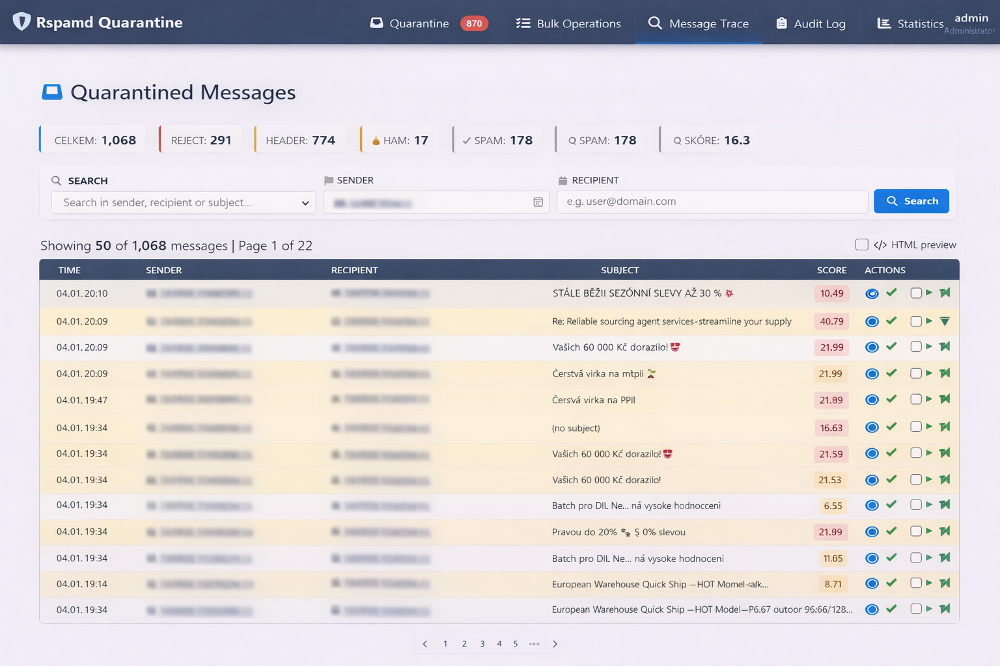
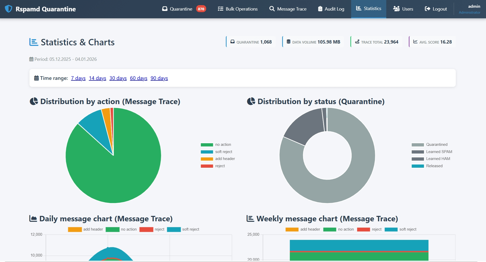
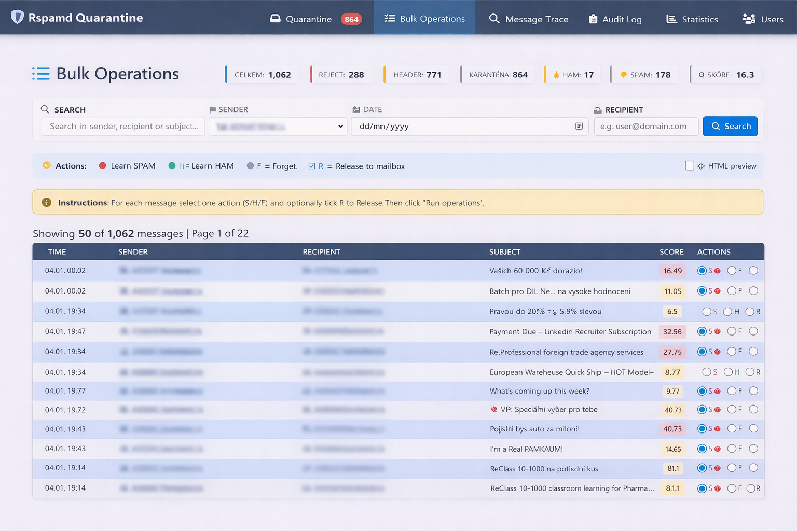
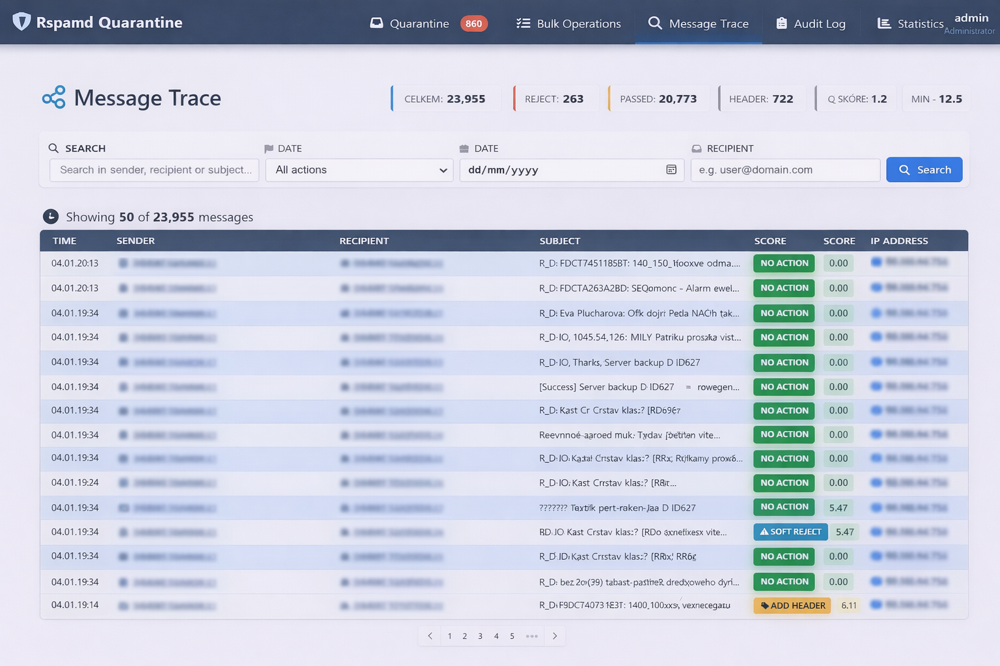
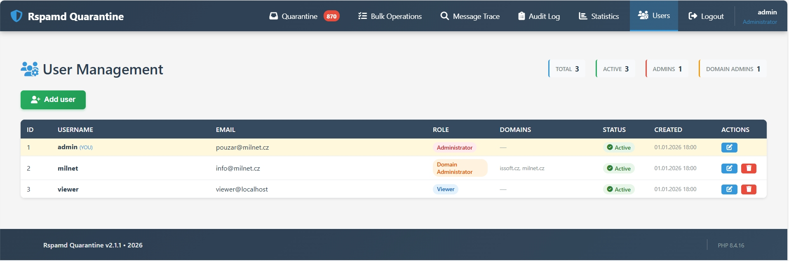

# Rspamd Quarantine Web UI

Rspamd Quarantine Web UI is a lightweight web application for browsing, managing, and auditing messages processed by an Rspamd‑based mail infrastructure. It is designed for system administrators and helpdesk staff who need fast, safe control over quarantined mail, message traces, and user actions.


---

## Features

### Quarantine Browser
- **Compact table view** with state‑based row coloring (quarantined, spam, ham, released)
- **Quick actions**: release, learn as spam/ham, delete
- **Advanced filtering**: sender, recipient, subject, score range, dates, and state
- **Message preview** with HTML/text toggle in tooltip
- **Symbol popup** showing Rspamd symbols and scores on hover

### Advanced Filtering
- Compact filter bar with visual highlighting of active fields
- Per‑field clear buttons with automatic form submission
- Badge showing number of active filters
- Automatic submit on select changes
- Gradient styling with modern UI/UX

### Message Trace
- Complete history of all processed messages
- Fields: timestamp, sender, recipients, IP address, authenticated user, action, score, symbols
- Useful for debugging deliverability and spam classification issues
- Same filtering capabilities as quarantine view

### Statistics and Charts
- **Volume statistics** for quarantine and trace data
- **Top senders/recipients** with sortable tables (up to 40 records)
- **Action distribution** pie chart (reject, soft reject, add header, no action, pass)
- **State distribution** chart (quarantined, spam, ham, released)
- **Daily and weekly trend charts** with stacked view
- Responsive 2×2 grid layout for charts
- Color scheme aligned with Rspamd semantics

### Inline Summary Header
- Shared header across all views with inline statistic boxes:
  - Total messages
  - Rejected
  - Quarantined
  - HAM/SPAM learned
  - Released
  - Average score

### Audit Log
- Dedicated **Audit Log** view for compliance and security
- Records all user actions:
  - Message releases
  - Spam/HAM training
  - Deletions
  - User logins
- Shows username, action type, timestamp, IP address, and details
- Colored badges and icons per action type
- Same compact table + filter design as main views

### Role‑Based Access Control
Three access levels:
- **admin** – full access to all data and domains
- **domainadmin** – restricted to configured domains only
- **viewer** – read‑only access as configured

Domain filters are automatically applied in all SQL queries (quarantine, trace, stats, audit).

### Language Auto‑Detection
- UI language is selected automatically based on the browser locale
- Supported languages: **cs**, **sk**, **en**, **de**

### Database Schema
Complete MariaDB/MySQL schema with:
- **Core tables**: `quarantine_messages`, `message_trace`
- **Audit tables**: `audit_log`, `trace_log`
- **User management**: `users`, `user_domains`, `sessions`
- **Helper views**:
  - `v_daily_stats` – daily message statistics
  - `v_quarantine_stats_by_domain` – domain-based quarantine metrics
  - `v_spam_ips` – top spam IP addresses
  - `v_top_spammers` – most active spam senders
  - `v_users_with_domains` – user-domain relationships
  - `v_user_activity` – user action summary

### Security Features
- Authentication required on all entry points
- Role-based permission checks per view and action
- Consistent HTML escaping for XSS prevention
- Domain-based SQL filters in prepared statements
- Audit triggers for login tracking
- Password hashing with PHP's `password_hash()`

---

## Technology Stack

- **Backend**: PHP 8+ (PDO, sessions)
- **Database**: MariaDB/MySQL with full schema and views
- **Mail Engine**: Rspamd (as upstream data source)
- **Frontend**: HTML5/CSS3 with custom compact UI
- **Icons**: Font Awesome 6.4+
- **Charts**: Chart.js 4.4+

---

## Screenshots

### Quarantine View
Compact table with inline statistics, filters, and quick actions.


### Statistics Dashboard
2×2 grid with action/state distribution charts and time-based trends.


### Audit Log
Complete user action history with filtering and pagination.


### Bulk Operations
Bulk operations view with inline actions and filters.


### Message Trace
Trace view for sender/recipient activity and scoring.


### User Management
User and role management overview.


---

## Requirements

- PHP 8.0 or higher
- MariaDB 10.5+ or MySQL 8.0+
- PDO MySQL extension
- Apache/Nginx web server
- Rspamd mail filtering system

---

## Installation

### 1. Clone Repository

```bash
git clone https://github.com/your-org/rspamd-quarantine-webui.git
cd rspamd-quarantine-webui
```

### 2. Create Database

Create a new MariaDB/MySQL database:

```bash
mysql -u root -p
```

```sql
CREATE DATABASE rspamd_quarantine CHARACTER SET utf8mb4 COLLATE utf8mb4_unicode_ci;
CREATE USER 'rspamd_user'@'localhost' IDENTIFIED BY 'your_secure_password';
GRANT ALL PRIVILEGES ON rspamd_quarantine.* TO 'rspamd_user'@'localhost';
FLUSH PRIVILEGES;
EXIT;
```

Import the schema:

```bash
mysql -u root -p rspamd_quarantine < database.sql
```

### 3. Configure Application

Copy the sample config and adjust settings:

```bash
cp config.example.php config.php
```

Edit `config.php`:

```php
<?php
// Database configuration
define('DB_HOST', 'localhost');
define('DB_NAME', 'rspamd_quarantine');
define('DB_USER', 'rspamd_user');
define('DB_PASS', 'your_secure_password');
define('DB_CHARSET', 'utf8mb4');

// Application settings
define('ITEMS_PER_PAGE', 50);
define('SESSION_TIMEOUT', 3600); // 1 hour

// Auto-learn settings (optional)
define('AUTOLEARN_ENABLED', true);
define('AUTOLEARN_SCORE', 15.0);
?>
```

### 4. Web Server Setup

**Apache** - Create a virtual host:

```apache
<VirtualHost *:443>
    ServerName quarantine.example.com
    DocumentRoot /var/www/rspamd-quarantine-webui

    <Directory /var/www/rspamd-quarantine-webui>
        Options -Indexes +FollowSymLinks
        AllowOverride All
        Require all granted
    </Directory>

    SSLEngine on
    SSLCertificateFile /path/to/cert.pem
    SSLCertificateKeyFile /path/to/key.pem
</VirtualHost>
```

**Nginx** - Configuration example:

```nginx
server {
    listen 443 ssl http2;
    server_name quarantine.example.com;
    root /var/www/rspamd-quarantine-webui;
    index index.php;

    ssl_certificate /path/to/cert.pem;
    ssl_certificate_key /path/to/key.pem;

    location / {
        try_files $uri $uri/ /index.php?$query_string;
    }

    location ~ \.php$ {
        fastcgi_pass unix:/var/run/php/php8.2-fpm.sock;
        fastcgi_index index.php;
        fastcgi_param SCRIPT_FILENAME $document_root$fastcgi_script_name;
        include fastcgi_params;
    }
}
```

### 5. Configure Rspamd

Add a metadata exporter rule that posts Rspamd results to the quarantine UI. Create or edit `/etc/rspamd/local.d/metadata_exporter.conf`:

```conf
# /etc/rspamd/local.d/metadata_exporter.conf
rules {
    HTTP_QUARANTINE {
        backend = "http";
        url = "http://127.0.0.1/rspamd-quarantine/receiver.php";
        selector = "is_spam";
        formatter = "default";
        meta_headers = true;
        timeout = 10s;
    }

    HTTP_TRACE_ALL {
        backend = "http";
        url = "http://127.0.0.1/rspamd-quarantine/trace_receiver.php";
        selector = "default";
        formatter = "json";
        timeout = 5s;
    }
}
```

Reload Rspamd after the change:

```bash
systemctl reload rspamd
```

### 6. Nastavení Postfix milteru

Přidejte následující nastavení do `/etc/postfix/main.cf`:

```conf
smtpd_milters = inet:127.0.0.1:11332
milter_default_action = accept
milter_protocol = 6
non_smtpd_milters =
milter_mail_macros = i {mail_addr} {client_addr} {client_name} {auth_authen}

# Bypass pro localhost (DISABLE milters)
smtpd_milter_maps = cidr:/etc/postfix/smtpd_milter_maps
milter_default_action = accept
```

### 7. Create Admin User

Generate a password hash:

```php
<?php
echo password_hash('your_password', PASSWORD_DEFAULT);
?>
```

Insert admin user into database:

```sql
INSERT INTO users (username, password_hash, email, role, active) 
VALUES ('admin', '$2y$10$...', 'admin@example.com', 'admin', 1);
```

For domain admins, also insert domains:

```sql
INSERT INTO user_domains (user_id, domain) 
VALUES (1, 'example.com'), (1, 'example.org');
```

### 8. File Permissions

```bash
chown -R www-data:www-data /var/www/rspamd-quarantine-webui
chmod 755 /var/www/rspamd-quarantine-webui
chmod 600 config.php
```

---

## Usage

### Accessing the Interface

1. Open your browser and navigate to:
   ```
   https://quarantine.example.com/
   ```

2. Log in with admin credentials

3. Use the top navigation menu:
   - **Karanténa** – Quarantined messages browser
   - **Message Trace** – Complete message history
   - **Statistiky** – Statistics and charts
   - **Audit Log** – User action history (admin/domainadmin only)

### Working with Messages

**Releasing a message:**
1. Find the message in quarantine view
2. Click the paper plane icon (release button)
3. Confirm the action

**Training spam/ham:**
- Click the ban icon to mark as SPAM
- Click the check icon to mark as HAM

**Deleting messages:**
- Click the trash icon and confirm deletion

### Using Filters

1. Enter search criteria in the filter bar
2. Active filters are highlighted with blue border
3. Use the × button to clear individual fields
4. Click "Hledat" to apply filters
5. Click "Reset" to clear all filters

---

## Project Structure

```
rspamd-quarantine-webui/
├── index.php              # Main quarantine view
├── trace.php              # Message trace view
├── stats.php              # Statistics and charts
├── audit.php              # Audit log view
├── view.php               # Single message detail view
├── operations.php         # Message operations handler
├── login.php              # Login page
├── logout.php             # Logout handler
├── functions.php          # Core helper functions
├── filterhelper.php       # Filter rendering functions
├── config.php             # Configuration (create from example)
├── config.example.php     # Configuration template
├── database.php           # Database connection class
├── menu.php               # Top navigation menu
├── style.css              # Main stylesheet
├── stats-inline.css       # Inline statistics styling
├── database.sql           # Database schema
├── api/
│   └── message_preview.php # AJAX message preview endpoint
└── README.md              # This file
```

---

## Configuration Options

### config.php

```php
// Database
define('DB_HOST', 'localhost');
define('DB_NAME', 'rspamd_quarantine');
define('DB_USER', 'rspamd_user');
define('DB_PASS', 'password');

// Pagination
define('ITEMS_PER_PAGE', 50);

// Session
define('SESSION_TIMEOUT', 3600);

// Auto-learn
define('AUTOLEARN_ENABLED', true);
define('AUTOLEARN_SCORE', 15.0);

// Debug mode (development only)
define('DEBUG_MODE', false);
```

---

## Troubleshooting

### Database Connection Errors

Check credentials in `config.php` and verify database permissions:

```sql
SHOW GRANTS FOR 'rspamd_user'@'localhost';
```

### Permission Denied

Ensure web server user has read access:

```bash
ls -la /var/www/rspamd-quarantine-webui
```

### Session Issues

Verify PHP session directory is writable:

```bash
sudo chmod 777 /var/lib/php/sessions
```

### Chart.js Not Loading

Check browser console for JavaScript errors and ensure CDN is accessible.

---

## Contributing

Contributions are welcome! Please follow these guidelines:

1. **Fork the repository**
2. **Create a feature branch**:
   ```bash
   git checkout -b feature/your-feature-name
   ```
3. **Commit your changes**:
   ```bash
   git commit -am 'Add new feature: description'
   ```
4. **Push to the branch**:
   ```bash
   git push origin feature/your-feature-name
   ```
5. **Submit a pull request**

### Code Standards

- Follow PSR-12 coding style for PHP
- Use meaningful variable and function names
- Comment complex logic
- Test all database queries with different user roles
- Ensure XSS protection on all user inputs

---

## Security

If you discover a security vulnerability, please email security@example.com instead of using the issue tracker.

---

## License

This project is licensed under the **GNU General Public License v3.0** - see the [LICENSE](LICENSE) file for details.

### GPL-3.0 Summary

You are free to:
- Use this software for any purpose
- Study and modify the source code
- Distribute copies
- Distribute modified versions

Under the following terms:
- Source code must be made available when distributing
- Modifications must be released under GPL-3.0
- Changes must be documented
- No warranty is provided

---

## Acknowledgments

- **Rspamd Team** – for the excellent mail filtering system
- **Chart.js** – for beautiful, responsive charts
- **Font Awesome** – for comprehensive icon library
- **MariaDB/MySQL** – for robust database engine

---

## Support

- **Issues**: https://github.com/your-org/rspamd-quarantine-webui/issues
- **Documentation**: https://github.com/your-org/rspamd-quarantine-webui/wiki
- **Discussions**: https://github.com/your-org/rspamd-quarantine-webui/discussions

---

## Roadmap

- [ ] REST API for external integrations
- [ ] Bulk operations interface improvements
- [ ] Email notifications for quarantined messages
- [ ] Advanced reporting with PDF export
- [ ] Dark mode theme
- [ ] Multi-language support (i18n)
- [ ] Docker container support
- [ ] Rspamd WebUI integration

---

## Changelog

### Version 2.0.0 (2026-01-04)
- Complete UI redesign with modern gradient styling
- Inline statistics in header across all views
- Compact filter bar with visual active field highlighting
- Audit log view with action tracking
- Enhanced charts with 2×2 grid layout
- Symbol popup with per-symbol scoring
- Auto-learn spam highlighting
- Message preview with HTML/text toggle
- Improved mobile responsiveness

### Version 1.0.0
- Initial release
- Basic quarantine management
- Message trace view
- Simple statistics

---

**Made with ❤️ for the Rspamd community**
